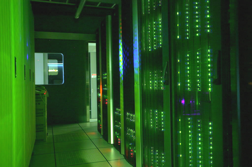
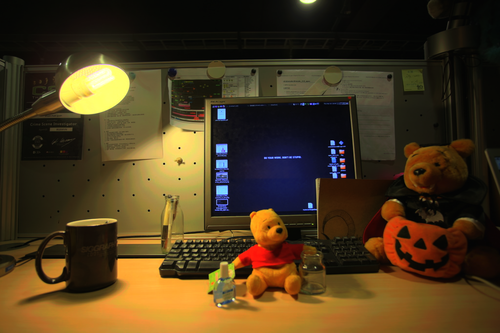
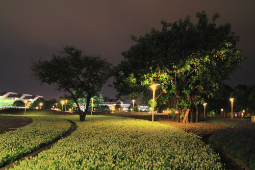

# [Digital Visual Effects 2011 Spring](http://www.csie.ntu.edu.tw/~cyy/courses/vfx/11spring/ "Digital Visual Effects 2011 Spring") @ CSIE.NTU.EDU.TW
## project #1: High Dynamic Range Imaging ([original link](http://www.csie.ntu.edu.tw/~cyy/courses/vfx/11spring/assignments/))

D99944013,
Shuen-Huei (Drake) Guan,
(drake.guan@gmail.com)

doc online: [vfx11spring_project1/](vfx11spring_project1/ "online document")

## Preliminaries

### Objective of the project

This project is my testing plan of examining the power and possibility of Open source for an university course, [VFX](http://www.csie.ntu.edu.tw/~cyy/courses/vfx/11spring/overview/ "Digital Visual Effects 2011 Spring"), lectured by Prof. [Yung-Yu Chuang](http://www.csie.ntu.edu.tw/~cyy/ "Yung-Yu Chuang 莊永裕"). There are totally 4 projects, each one for an assignment in the course. This project will host my working history of assignments and hopefully, there is something informative or helpful to myself and others :)

### Introduction to the course

With the help of digital technology, visual effects have been widely used in film production lately. For example, up to April 2004, the top ten all-time best selling movies are so-called "effects movies." Six of them even won Academic awards for their visual effects. This course will cover the techniques from computer graphics, computer vision and image processing with practical or potential usages in making visual effects.

## Project description

High dynamic range (HDR) images have much larger dynamic ranges than traditional images' 256 levels. In addition, they correspond linearly to physical irradiance values of the scene. Hence, they are useful for many graphics and vision applications. In this assignment, you are asked to finish the following tasks to assemble an HDR image in a group of two.

### HDR artifact  

### Algorithm

The following algorithms are implemented:

* HDR: Debevec's algorithm in Matlab. (gsolve.m + hdrDebevec.m)
* Tone Mapping: Reinhard's algorithm in Matlab. (tmoReinhard02.m)

The whole project is implemented in Matlab, the language cool about scientific programming and visualization plotting. The entry point is *main.m*. The flow of the program is as following:

* Load an image set with different exposure for each picture taken by *readImages*.
* Prepare a down-sampling of the image set for the following *gsolve.m*.
* Prepare a weighting function by Debevec's 1997 paper.
* Put all stuff above into *gsolve*, each channel (assuming R, G and B) is processed separately. After this step, we get the camera's response curve(function). We can plot it directly by *plot* with some axis description if necessary.
* Invoke *hdrDebevec* to reconstruct the HDR.
* Invoek *tmoReinhard02* to get tone-mapped LDR image.

## Approach

### Taking photos

Canon 5D EOS is used to take as many pictures as possible for each scene. In order to make sure the *stillness*, a tripod is used. Furthermore, [DSLR Camera Remote](http://www.ononesoftware.com/products/dslr-camera-remote/ "DSLR Camera Remote") is also installed on a Mac wired with a USB line to the camera to do somehow *remote shooting without touching the camera*. The results turn out good enough such that no alignment algorithm is needed.

### Alignment

Skip.

### Camera response curve & HDR

Debevec's algorithm (gsolve.m + hdrDebevec.m) is used to recover the camera's response curve. 

* *gsolve.m* is borrowed from Debevec's paper for reconstructing the camera's response curve,
* *hdrDebevec.m* is to convert those LDR images into a HDR image.

In this algorithm, several sampling pixels need to pick up to feed into *gsolve*. According to the paper and slides, 50~100 pixels are reasonable number. The issue comes next is, *which pixel should I pick up into the sampling bin?* A random pick-up has been tested several times and if the number is bigger enough, the result looks good. But that is not that guaranteed. By observation, an image shrinking operator can be applied to the original images to get smaller ones. Those reduced images stil capture somehow the original images' characteristics. As long as the size is smaller enough, we can feed all pixels in smaller ones to *gsolve*. The default size of the reduced images is (width: 20, height: 10), which turns out 200 sampling pixels, bigger enough for *gsolve*.

One more issue to take care of in *hdrDebevec* is computational error. Because Matlab is such powerful that there is seldom error while computing out *NaN* or *Inf*. After several testing, we found we should replace those *NaN* and *Inf* by 0 to make the following tone mapping work.

#### Histogram of the reconstructed corridor HDR

### Tone mapping

Reinhard's algorithm is implemented in *tmoReinhard02.m*. Only global operator is implemented here. 

> The only trick here is that we first convert those images into luminance (or intensity). That is, converting 3-channel images into 1-channel images. Then, apply tone mapping operator on those luminance images. And finally multiply tone-mapped luminance by resting colors to get the final result. The reason behind this is a really interesting discovery. If the tone mapping operator is applied separately on each channel, the resulting LDR would have some sort of color shifting cause each channel has different *LwMean*!

The above idea is still questionable and doubtable cause I haven't spent much time to realise the physical meanings behind. That is just my random thought and I even rollback the code to apply directly on all 3 channels instead of the luminance!

## Results

Corridor  

Desktop01  

Desktop02  

Digimax Gate  

Restroom  

Scene (contributed by VicJuan)  

Servers  

Station (contributed by VicJuan)  

Please take a look at the folder [tone mapped images](image/tone-mapped 'tone mapped images') for details.

## References

* Paul E. Debevec, Jitendra Malik, Recovering High Dynamic Range Radiance Maps from Photographs, SIGGRAPH 1997
* Matlab, <http://www.mathworks.com/help/techdoc/>

